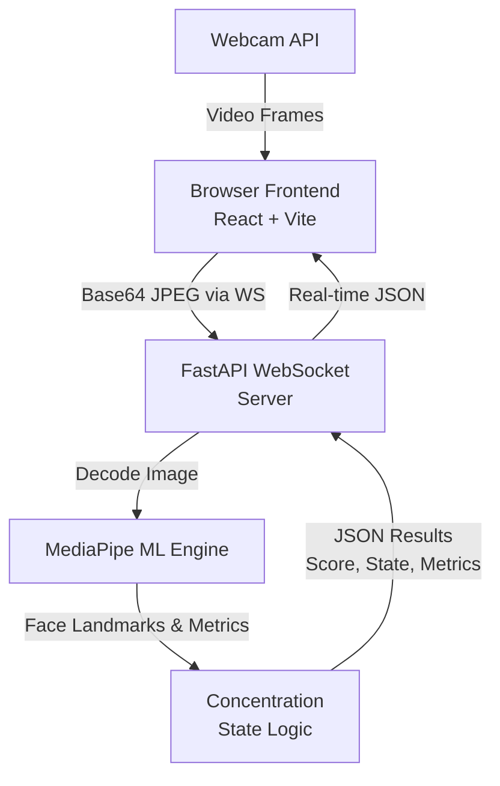
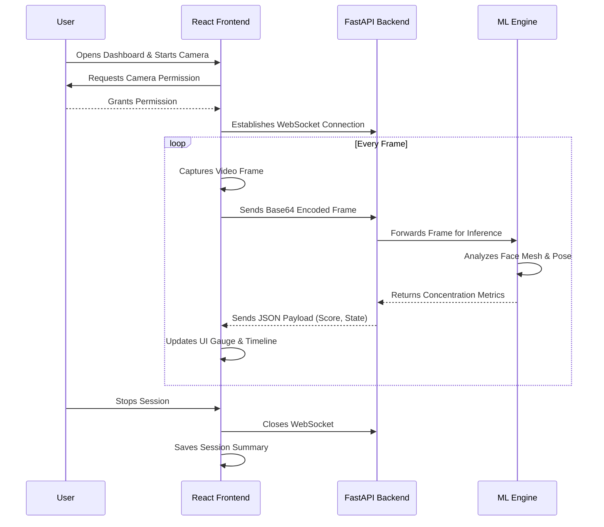

# ConcentraAI — Student Concentration Detection System

A real-time AI-powered student concentration monitoring system. Uses **MediaPipe Face Mesh** and **OpenCV** on the backend, with a stunning **React** dashboard frontend. Detects and classifies student states as **Focused**, **Distracted**, **Sleepy**, or **Absent**.

## 🖥️ Architecture & Workflow

### System Architecture



### Real-Time Workflow



- **Frontend**: React + Vite — captures webcam in browser, displays real-time dashboard
- **Backend**: FastAPI + WebSocket — receives frames, runs ML inference, returns JSON
- **ML Engine**: MediaPipe Face Mesh + OpenCV — EAR, head pose, gaze, state detection

## ✨ Features

- 🎯 Real-time concentration detection via webcam
- 📊 Live concentration score gauge (0-100%)
- 🧠 State classification: Focused, Distracted, Sleepy, Absent
- 📈 Session timeline chart with history
- 📱 Fully responsive: Desktop, Tablet, Mobile
- 🎨 Premium dark theme with glassmorphism UI
- ⚡ WebSocket-based low-latency processing

## 🚀 Quick Start

### Prerequisites
- Python 3.8+
- Node.js 18+
- Webcam

### 1. Install Backend Dependencies

```bash
cd ML-Backend
pip install -r requirements.txt
```

### 2. Install Frontend Dependencies

```bash
cd frontend
npm install
```

### 3. Run the Application

**Terminal 1 — Backend (FastAPI)**:
```bash
cd ML-Backend
python -m uvicorn app.api:app --host 0.0.0.0 --port 8000 --reload
```

**Terminal 2 — Frontend (React)**:
```bash
cd ML-Backend/frontend
npm run dev
```

### 4. Open the App

Navigate to **http://localhost:5173** in your browser. Click **Start Detection** and allow camera access.

## 📂 Project Structure

```
ML-Backend/
├── app/
│   ├── __init__.py
│   ├── api.py              # FastAPI WebSocket + REST API
│   └── ml_engine.py         # MediaPipe concentration detection engine
├── frontend/
│   ├── src/
│   │   ├── components/
│   │   │   ├── Navbar.jsx
│   │   │   ├── WebcamView.jsx
│   │   │   ├── ConcentrationGauge.jsx
│   │   │   ├── MetricsPanel.jsx
│   │   │   ├── TimelineChart.jsx
│   │   │   └── SessionStats.jsx
│   │   ├── hooks/
│   │   │   ├── useConcentraSocket.js
│   │   │   └── useWebcam.js
│   │   ├── App.jsx
│   │   ├── main.jsx
│   │   └── index.css
│   ├── index.html
│   ├── vite.config.js
│   └── package.json
├── main.py                  # Original desktop version (legacy)
├── requirements.txt
└── README.md
```

## 🔌 API Endpoints

| Method | Endpoint | Description |
|--------|----------|-------------|
| `GET` | `/health` | Health check |
| `WS` | `/ws/{client_id}` | WebSocket for real-time frame processing |
| `GET` | `/api/session/{client_id}` | Get session summary |
| `POST` | `/api/session/{client_id}/reset` | Reset session data |

### WebSocket Protocol

**Client sends:**
```json
{ "image": "data:image/jpeg;base64,..." }
```

**Server responds:**
```json
{
  "state": "Focused",
  "concentration": 85.0,
  "face_detected": true,
  "ear": 0.287,
  "yaw": 5.2,
  "pitch": -3.1,
  "gaze_h": 0.483,
  "gaze_v": 0.512,
  "blink_count": 14,
  "session_duration": 45.2
}
```

## 🚢 Deployment

### Build Frontend for Production

```bash
cd frontend
npm run build
```

This creates `frontend/dist/` which the FastAPI app auto-serves.

### Run in Production

```bash
python -m uvicorn app.api:app --host 0.0.0.0 --port 8000
```

### Deploy to Render / Railway

1. Set build command: `cd frontend && npm install && npm run build`
2. Set start command: `uvicorn app.api:app --host 0.0.0.0 --port $PORT`
3. Set Python + Node.js buildpacks

## 🎛️ Configuration

Edit thresholds in `app/ml_engine.py`:

```python
EYE_AR_THRESH = 0.25          # Eye closure threshold
SLEEPY_TIME_THRESHOLD = 2.0   # Seconds for sleepy state
HEAD_POSE_THRESHOLD = 30      # Degrees for head turn
GAZE_THRESHOLD = 0.15         # Gaze deviation threshold
```

## 📄 License

Free to use for educational purposes.
